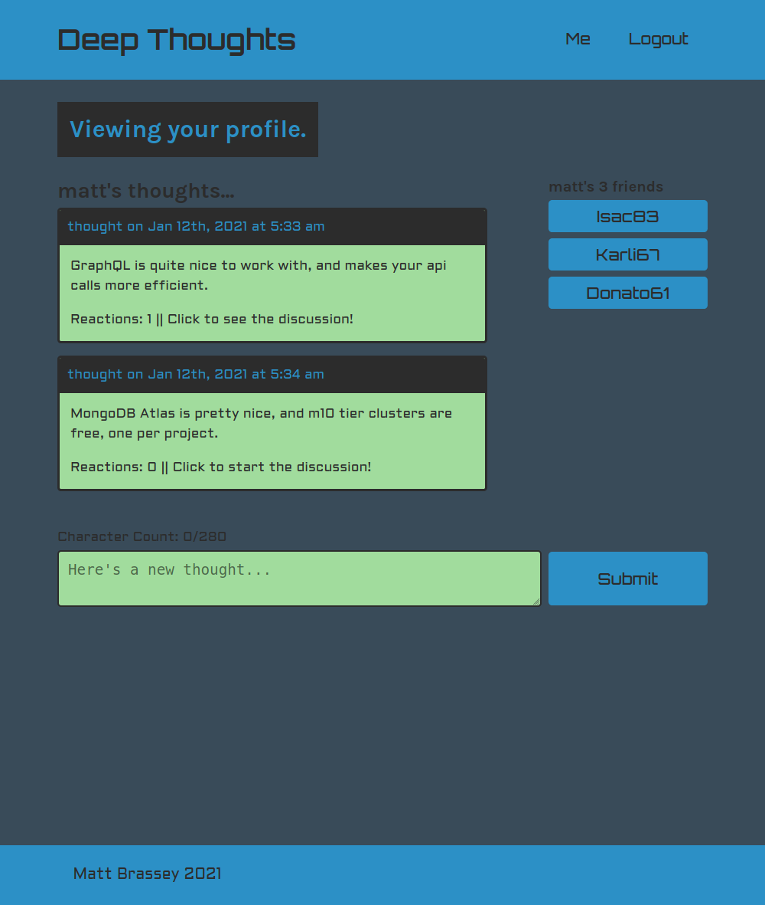
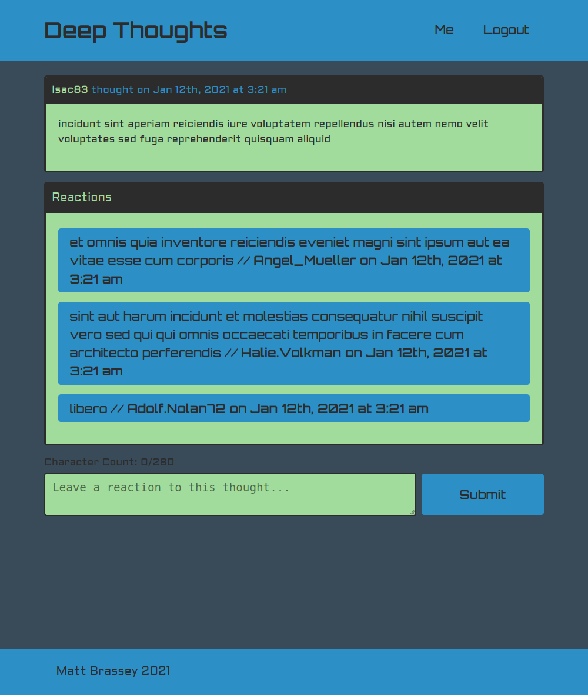

    
    
    
    
    
    
    

## deep-thoughts

MERN (MongoDB, Express.js, React, and Node.js) stack social network. SPA (Single Page Application) utilizing react router, GraphQL and JWT (JSON Web Token) authentication. The backend application is deployed live @Heroku utilizing MongoDB Atlas.

#### Issues

- [x] [Set up GraphQL queries](https://github.com/MBrassey/deep-thoughts/issues/1)
- [x] [Set up mutations and JWT logic](https://github.com/MBrassey/deep-thoughts/issues/2)
- [x] [Implement client-side GraphQL query for homepage data](https://github.com/MBrassey/deep-thoughts/issues/3)
- [x] [Implement GraphQL queries and navigation for other pages](https://github.com/MBrassey/deep-thoughts/issues/4)
- [x] [Client-side login/sign up](https://github.com/MBrassey/deep-thoughts/issues/5)
- [x] [Implement user-based mutations](https://github.com/MBrassey/deep-thoughts/issues/6)
- [x] [Finish up & Deploy](https://github.com/MBrassey/deep-thoughts/issues/7)
- [x] [Create Readme](https://github.com/MBrassey/deep-thoughts/issues/8)

#### Requirements

    MongoDB Community Server
    node
    npm

#### Installation

    install MongoDB
    npm install

#### Usage

    npm run seed
    npm start
    browse to http://localhost:3000/
    browse to http://localhost:3001/graphql/

<h6>
:cyclone: Click the image(s) below to view the live <a id="Screenshots" href="https://mbrassey-deep-thoughts.herokuapp.com/">webapplication</a>
</h6>

> Main Feed
> 

> User Dashboard (LoggedIn)
> 

> Single Thought with Reactions
> 

> Setup
> 

> GraphQL Queries
> 

#### Questions

Contact me at [matt@brassey.io](mailto:matt@brassey.io) with any questions or comments.

#### License

`deep-thoughts` is published under the **CC0_1.0_Universal** license.

> The Creative Commons CC0 Public Domain Dedication waives copyright interest in a work you've created and dedicates it to the world-wide public domain. Use CC0 to opt out of copyright entirely and ensure your work has the widest reach. As with the Unlicense and typical software licenses, CC0 disclaims warranties. CC0 is very similar to the Unlicense.

